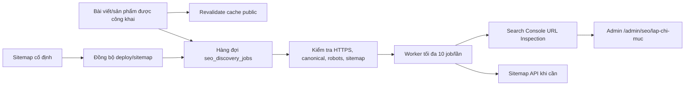

# Vận hành Google Search Console và SEO Discovery

Hệ thống này giúp Google **khám phá** URL công khai mới, kiểm tra URL có đủ điều
kiện SEO hay không và lưu lại trạng thái mà Search Console quan sát được. Hệ
thống không bảo đảm Google sẽ crawl hoặc lập chỉ mục một URL trong một thời hạn
cụ thể.

Mushroomie chỉ dùng:

- Search Console Sitemap API để đăng ký `https://mushroomie.io.vn/sitemap.xml`
  khi sitemap đang thiếu hoặc Google báo lỗi.
- URL Inspection API để đọc trạng thái của phiên bản URL trong Google Index.

Mushroomie **không dùng Google Indexing API**. Theo tài liệu chính thức, API đó
chỉ dành cho trang có `JobPosting` hoặc `BroadcastEvent` nằm trong
`VideoObject`, không phù hợp với bài viết và sản phẩm của Mushroomie. URL
Inspection API cũng không có thao tác tương đương nút **Request indexing** trong
giao diện Search Console, nên không thể tự động hóa nút này bằng API hợp lệ.

Tài liệu Google liên quan:

- [Submit sitemap](https://developers.google.com/webmaster-tools/v1/sitemaps/submit?hl=en)
- [Inspect URL index status](https://developers.google.com/webmaster-tools/v1/urlInspection.index/inspect?hl=en)
- [Search Console API usage limits](https://developers.google.com/webmaster-tools/limits?hl=en)
- [Indexing API eligibility](https://developers.google.com/search/apis/indexing-api/v3/using-api?hl=en)

## Kiến trúc và luồng xử lý



Publication luôn là luồng chính. Lỗi hàng đợi, mạng hoặc Google chỉ được ghi
nhận theo cơ chế fail-soft; không được làm hỏng thao tác đăng bài hoặc kích hoạt
sản phẩm. Worker chạy ngoài public request rendering, có lease/CAS và giới hạn
tối đa 10 job mỗi batch.

## Cấu hình mặc định an toàn

Triển khai lần đầu với cả hai cờ đều tắt:

```dotenv
SEO_DISCOVERY_ENABLED=false
GSC_INTEGRATION_ENABLED=false
GSC_PROPERTY=sc-domain:mushroomie.io.vn
GOOGLE_APPLICATION_CREDENTIALS=/etc/mushroomie/gsc-service-account.json
```

| Biến | Ý nghĩa |
|---|---|
| `SEO_DISCOVERY_ENABLED` | Bật ghi nhận và xử lý hàng đợi discovery. Cache revalidation vẫn hoạt động khi cờ tắt. |
| `GSC_INTEGRATION_ENABLED` | Cho phép gọi Search Console. Cờ này chỉ được bật sau khi kiểm tra kết nối thành công. |
| `GSC_PROPERTY` | Property chính xác trong Search Console; production dùng `sc-domain:mushroomie.io.vn`. |
| `GOOGLE_APPLICATION_CREDENTIALS` | Đường dẫn tuyệt đối đến service-account JSON nằm ngoài repository và `public`. |

Adapter dùng `google-auth-library@11.0.0`, vì vậy build server và production phải
chạy Node.js 22 trở lên. `npm run check:node` phải chạy trước bước cài dependency,
build, migration hoặc restart PM2.

## Chuẩn bị service account

1. Tạo một Google Cloud service account riêng cho Mushroomie và bật Search
   Console API cho project đó.
2. Đặt JSON tại `/etc/mushroomie/gsc-service-account.json`, ngoài
   `/var/www/mushroomie`, ngoài `public` và ngoài thư mục uploads.
3. Sau khi xác minh đúng user/group chạy ứng dụng, giới hạn quyền đọc:

   ```bash
   sudo chown <app-user>:<app-group> /etc/mushroomie/gsc-service-account.json
   sudo chmod 600 /etc/mushroomie/gsc-service-account.json
   ```

4. Lấy `client_email` trong JSON và thêm email đó vào property
   `sc-domain:mushroomie.io.vn` trên Search Console với mức quyền thấp nhất vẫn
   đủ đọc URL Inspection và quản lý sitemap.
5. `.env` chỉ chứa **đường dẫn**. Không dán JSON, private key, token, client
   secret hoặc base64 vào `.env`, Git, database, log hay giao diện admin.

Adapter chỉ chấp nhận credential `type=service_account`, là file thường, đọc
được, không quá 64 KiB và có realpath nằm ngoài repository/public. Mọi request
Search Console có deadline tổng 15 giây, không đi theo redirect; lỗi và response được chuẩn hóa
để không lộ token, URL query hoặc credential path.

Khi `SEO_DISCOVERY_ENABLED=true` nhưng `GSC_INTEGRATION_ENABLED=false`, riêng
thao tác admin đã xác thực **Kiểm tra kết nối** được phép tạo probe giới hạn. Probe
gọi một lần Sitemap API và một lần URL Inspection cho URL cố định của trang chủ
để xác minh cả hai quyền. Worker và mọi lời gọi Google tự động vẫn bị tắt. Probe
không được bỏ qua master switch discovery, credential boundary, phân quyền admin,
same-origin guard hay rate limit; một lần probe tiêu thụ một request Inspection.

### Tự động đối soát sitemap

Khi `SEO_DISCOVERY_ENABLED=true`, maintenance đối soát sitemap ngay sau khi
process PM2 khởi động và sau đó tối đa một lần thành công mỗi 60 phút. Interval
60 giây chỉ kiểm tra điều kiện đến hạn; nó không tải sitemap mỗi phút. Protected
cron dùng chung coordinator trong cùng process, vì vậy hai trigger đồng thời chỉ
có một fetch/transaction.

Reconciliation chạy trước discovery worker. Nếu fetch, XML hoặc transaction lỗi,
mốc thành công không tiến lên và tick sau retry; publication, inventory và worker
vẫn tiếp tục. Khi `GSC_INTEGRATION_ENABLED=false`, bước này chỉ đối soát database,
không gọi Google.

## Backfill an toàn

Backfill chỉ đọc bài viết `published` chưa xóa và sản phẩm `active`, phân trang
ổn định từng 100 row, tạo URL từ origin cố định `https://mushroomie.io.vn` và
dùng đúng repository idempotent như sự kiện publication thật. Không có câu lệnh
xóa job.

Dry-run mặc định, không ghi database:

```bash
npm run seo:discovery:backfill
```

Kiểm tra JSON summary gồm `scanned`, `wouldCreate`, `wouldReset`, `unchanged` và
`errors`. Chỉ khi dry-run hợp lý và backup/schema đã được xác minh mới chạy:

```bash
npm run seo:discovery:backfill:apply
```

Nếu bất kỳ row nào không tạo được URL hoặc repository trả lỗi, lệnh vẫn in
summary để điều tra nhưng thoát khác 0 với mã ổn định
`SEO_DISCOVERY_BACKFILL_PARTIAL_FAILURE`. Không được coi một lần apply có
`errors > 0` là thành công và không tự động bỏ qua mã thoát này.

Không chấp nhận alias hoặc flag gần giống; chỉ đúng `--apply` mới cho phép ghi.
Chạy lặp lại an toàn: URL là unique key và content version cũ/bằng không reset
bằng chứng mới hơn.

## Trạng thái trong admin

Mở `/admin/seo/lap-chi-muc` bằng tài khoản `admin` hoặc `super_admin`. `viewer`
không được xem hoặc gọi API của màn hình này.

| Trạng thái | Cách hiểu và xử lý |
|---|---|
| `PENDING_ELIGIBILITY` | Chờ kiểm tra URL public, canonical, robots và sitemap. |
| `ELIGIBLE` | Đủ điều kiện và sẵn sàng kiểm tra Search Console. |
| `INDEXED` | Lần URL Inspection gần nhất trả verdict `PASS`; không phải cam kết vĩnh viễn. |
| `NOT_INDEXED` | Google chưa báo indexed; hệ thống kiểm tra lại theo lịch có giới hạn. |
| `RETRY` | Lỗi tạm thời như timeout, 429 hoặc 5xx; retry có exponential backoff + jitter, tối đa 24 giờ. |
| `SKIPPED` | URL không còn public/không còn trong sitemap hoặc đã xác nhận lỗi terminal. |
| `CONFIGURATION_REQUIRED` | Thiếu/sai credential, property hoặc quyền; sửa cấu hình rồi dùng **Kiểm tra kết nối**. |
| `ERROR` | Response hoặc trạng thái không hợp lệ cần admin xem bằng chứng đã được rút gọn. |

Với URL chưa indexed, các mốc kiểm tra dựa trên `content_updated_at`: sau 24 giờ,
72 giờ và 7 ngày; sau đó tối đa một lần mỗi 7 ngày. Một publication có content
version mới sẽ đưa job về luồng kiểm tra từ đầu. `attempt_count` chỉ đếm chuỗi lỗi
tạm thời và được reset sau một response Inspection hợp lệ.

URL Inspection có quota chính thức theo property là 2.000 request/ngày và 600
request/phút. Batch 10 chạy tối đa một lần/phút chỉ giới hạn tốc độ ngắn hạn ở
10 request/phút; **hệ thống hiện chưa có bộ đếm quota ngày bền vững**. Với backlog
luôn đầy, mức trần lý thuyết có thể là 14.400 lần/ngày, vì vậy không được suy ra
rằng batch nhỏ tự động bảo đảm quota ngày.

Ở lần rollout này, phải ghi lại tổng queue/due jobs ngay trước khi bật GSC. Snapshot
sitemap production khi lập baseline có 138 URL, đủ nhỏ cho một initial pass có
kiểm soát. Chỉ bật khi inventory thực tế vẫn dưới 1.000 URL và dành ít nhất 50%
quota ngày làm headroom cho probe/retry/recheck. Nếu inventory hoặc backlog đạt
1.000 trở lên, dừng rollout cho đến khi có durable daily budget. Theo dõi số job
được xử lý từ thời điểm bật; tắt ngay `GSC_INTEGRATION_ENABLED` trước khi tổng
Inspection trong ngày tiến gần 1.500. Không tăng tần suất để “ép index”.

## Trình tự rollout production

1. Xác minh đúng VPS mới, Node >=22, project path và backup. Không dùng host cũ
   `103.173.226.86`.
2. Review migration additive `seo_discovery_jobs`, xác nhận engine InnoDB, lock
   và cảnh báo unique index; chỉ apply sau xác nhận riêng.
3. Deploy code với hai cờ `false`; kiểm tra PM2, routes, static MIME, uploads,
   ảnh sản phẩm và QR thanh toán.
4. Bật riêng `SEO_DISCOVERY_ENABLED=true`, restart PM2, chạy dry-run rồi apply
   backfill và theo dõi queue. Giữ `GSC_INTEGRATION_ENABLED=false`.
   - Baseline 2026-08-12: sitemap 138 URL, queue 102 job, thiếu 37 URL
     trang tĩnh/local/catalog.
   - Sau restart rollout: chờ tối đa bốn worker tick để 37 URL mới hoàn tất
     eligibility; khi GSC còn tắt, kỳ vọng 138 URL hợp lệ ở
     `CONFIGURATION_REQUIRED`, một URL legacy ở `SKIPPED`, và không có lease treo.
5. Đặt credential ngoài repository, cấp quyền Search Console, vào trang admin và
   chạy **Kiểm tra kết nối** khi GSC vẫn `false`; xác minh probe báo connected và
   tổng inventory/backlog thực tế vẫn dưới ngưỡng rollout 1.000.
6. Chỉ khi property/quyền đúng mới bật `GSC_INTEGRATION_ENABLED=true`, restart
   PM2 và chạy một batch có kiểm soát.
7. Công khai một bài test hợp lệ hoặc kích hoạt một sản phẩm kiểm soát; xác minh
   canonical xuất hiện trong sitemap, có đúng một job, có eligibility evidence
   và URL Inspection evidence sau lịch chạy.

## Theo dõi và kiểm chứng

Các lệnh không in secret:

```bash
npm run check:node
pm2 status mushroomie_pm2
pm2 logs mushroomie_pm2 --lines 150 --nostream
curl -fsS https://mushroomie.io.vn/sitemap.xml >/dev/null
curl -fsS https://mushroomie.io.vn/feed.xml >/dev/null
npm run seo:discovery:backfill
```

Trong admin, theo dõi tổng theo status, timestamp Inspection/crawl, canonical do
Google chọn, error code đã rút gọn và số job cần cấu hình. Không copy response
Google thô hoặc credential vào ticket/log.

Sau deploy phải chạy lại ba Lighthouse run cho `/`, `/tin-tuc`, `/san-pham` ở
mobile và desktop với cùng Lighthouse 13.4.1/Chrome/runner rồi so median:

```bash
npm run perf:report -- artifacts/performance/before-*.json artifacts/performance/after-*.json
```

Reporter yêu cầu đúng run 1, 2, 3; báo fail nếu score giảm hơn 2 điểm, các chỉ số
FCP/LCP/TBT/CLS/total KiB/main-thread tăng hơn 5%, hoặc median homepage sau deploy
chưa đạt mục tiêu 100. Reporter cũng từ chối Lighthouse khác 13.4.1, Chrome runtime
khác nhau, sai canonical final URL, sai device/form-factor, thiếu ma trận đầy đủ
ba route × hai thiết bị, hoặc khác throttling method, network/CPU throttling và
screen emulation giữa các run/before/after.

Baseline hiện dùng Chrome for Testing 149 với cờ
`--headless=new --no-sandbox --disable-gpu`; route `/san-pham` dùng thêm
`--max-wait-for-load=45000`. Lần đo `after` phải giữ nguyên các cờ đó. Trên Windows,
Lighthouse đôi khi ghi JSON hợp lệ rồi trả lỗi cleanup profile tạm; không được bỏ
qua mù quáng. Chỉ nhận artifact sau khi reporter xác minh đúng version/runtime,
đủ audit và Performance score. Artifact Lighthouse nằm trong `.gitignore`, không
commit.

## Rollback và xử lý sự cố

- Dừng mọi Google call ngay: đặt `GSC_INTEGRATION_ENABLED=false`, restart PM2.
- Dừng cả enqueue/worker và mọi lần fetch sitemap tự động: đặt thêm
  `SEO_DISCOVERY_ENABLED=false`, restart PM2.
- Nếu chỉ đặt `GSC_INTEGRATION_ENABLED=false`, đối soát sitemap/database vẫn hoạt
  động nhưng không có lời gọi Google tự động.
- Giữ nguyên bảng `seo_discovery_jobs` khi rollback để bảo toàn audit/evidence;
  không drop table trong incident rollback.
- Publication, sitemap public, feed và cache revalidation phải tiếp tục hoạt động
  khi hai cờ tắt hoặc Google không khả dụng.
- Nếu key lộ/nghi lộ: tắt GSC flag, thu hồi key trên Google Cloud, cấp key mới,
  thay file ngoài repository, giữ `chmod 600`, kiểm tra kết nối rồi mới bật lại.
- 401/403: kiểm tra service account/property/quyền; không retry liên tục.
- 429/5xx/timeout: giữ backoff/cooldown hiện có; không tăng batch hoặc cron.
- Rollback release theo runbook PM2/Nginx, giữ `standalone.previous.<timestamp>`
  cho đến khi health và MIME checks đều pass.
